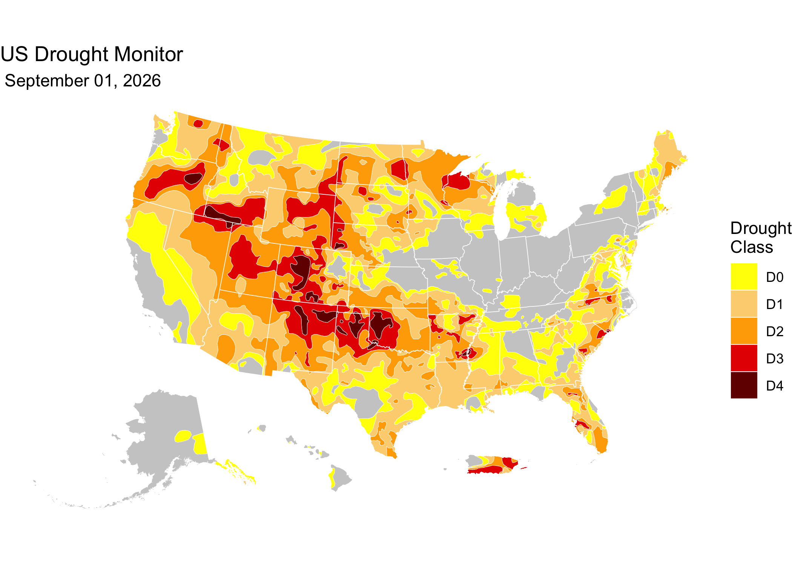

<!-- README.md is generated from README.Rmd. Please edit that file -->

[](https://github.com/sustainable-fsa/usdm/)


This repository provides a reproducible, archival-quality pipeline to
download, validate, transform, and document weekly shapefiles from the
[US Drought Monitor (USDM)](https://droughtmonitor.unl.edu). Both USDM
geometry products are archived: the **clipped** (masked) shapefiles that
make up the published USDM map, and the **unclipped** generalized
shapefiles as drawn by the USDM authors (see [Two geometry
products](#two-geometry-products)). The archive is structured using the
[BagIt 1.0
specification](https://tools.ietf.org/html/draft-kunze-bagit-14) and
includes:

- Raw weekly shapefiles (clipped and unclipped) and text summaries
- Cleaned, validated spatial data in GeoParquet format for both products
- Per-week ISO 19115-1 metadata in XML
- Geometry validation and raw-file provenance logs
- Weekly updating and manifest tracking

<a href="https://data.sustainable-fsa.com/usdm/" target="_blank">📂 View
the US Drought Monitor archive listing here.</a>

The goal of this repository is to draft a regulatory-grade archive of
the US Drought Monitor that conforms with the *Foundations for
Evidence-Based Policymaking Act of 2018* (“Evidence Act”, [Public Law
115–435](https://www.congress.gov/115/statute/STATUTE-132/STATUTE-132-Pg5529.pdf)),
the *Geospatial Data Act of 2018* (enacted as part of [Public Law
115–254](https://www.congress.gov/115/statute/STATUTE-132/STATUTE-132-Pg3186.pdf)),
and [Executive Order 14303, *Restoring Gold Standard
Science*](https://www.federalregister.gov/documents/2025/05/29/2025-09802/restoring-gold-standard-science).
Given the regulatory role played by the USDM (e.g., [7 CFR
1416.205](https://www.ecfr.gov/current/title-7/section-1416.205), [7 CFR
759.5](https://www.ecfr.gov/current/title-7/section-759.5)), it is
essential that an authoritative, well-documented, persistent, and
findable archive of the USDM be established by a Federal agency. This
work seeks to create a framework for such an archive.

------------------------------------------------------------------------

## 📈 About the US Drought Monitor (USDM)

The US Drought Monitor is a weekly map-based product that synthesizes
multiple drought indicators into a single national assessment. It is
produced by:

- National Drought Mitigation Center (NDMC)
- US Department of Agriculture (USDA)
- National Oceanic and Atmospheric Administration (NOAA)

Each weekly map represents a combination of data analysis and expert
interpretation.

> **Note**: This archive is maintained by the Montana Climate Office,
> but all analytical authorship of the USDM drought maps belongs to the
> named USDM authors.

### Two geometry products

NDMC distributes each weekly map in two spatial forms, and this archive
preserves both with identical processing:

- **Clipped (masked)** — the drought polygons masked to the US coastline
  and territorial boundaries, as distributed in NDMC’s [“M”
  shapefiles](https://droughtmonitor.unl.edu/data/shapefiles_m/)
  (`USDM_YYYYMMDD_M.zip`). This is the geometry shown on the published
  USDM map, and is what `data/raw/`, `data/parquet/`, and
  `data/metadata/` contain.
- **Unclipped** — the generalized drought-class polygons as delineated
  by the USDM authors, *not* masked to shorelines or boundaries
  (polygons extend beyond the coast). NDMC posts recent weeks at the
  [`shapefiles_r`
  root](https://droughtmonitor.unl.edu/data/shapefiles_r/) and older
  weeks in the [`shapefiles_r`
  Archive](https://droughtmonitor.unl.edu/data/shapefiles_r/Archive/)
  (`usdm_YYYYMMDD.zip`, one shapefile per drought class,
  `Drought_Areas_US_D0`–`D4`). These are archived in
  `data/raw_unclipped/`, `data/parquet_unclipped/`, and
  `data/metadata_unclipped/`, and are useful for custom masking, coastal
  analyses, and overlays with boundary data that differ from NDMC’s
  mask.

The drought classification is identical between the two products — only
the coastal/boundary masking and the way classes are represented differ.
Unclipped raw zips are archived byte-for-byte under their verbatim
upstream filenames (the NDMC listings mix `usdm_`/`USDM_` case); each
file’s source URL, upstream modification time, and size are recorded in
`data/quality/raw_unclipped_sources.csv`.

The two GeoParquet products share one schema (`date`, `usdm_class`) but
represent classes differently:

- **Clipped: mutually exclusive classes.** Each polygon’s `usdm_class`
  is *the* drought class at that location; the D0–D4 features tile the
  map without overlap.
- **Unclipped: cumulative (nested) classes.** NDMC’s source layers are
  cumulative — the D0 layer contains D1, and so on — and the archive
  preserves that: each class layer is cleaned and dissolved on its own,
  so a feature’s `usdm_class` means *this class or more severe*. D1 lies
  within D0, D2 within D1 (up to hairline differences where a week’s
  geometry needed repair), and the features overlap. Draw them in class
  order (D0 first) for a correct map, or difference each class with the
  next more severe one to recover exclusive polygons. Class areas should
  therefore shrink from D0 to D4; any week where they do not is recorded
  in `data/quality/nesting_unclipped.csv` (the pipeline flags it but
  does not alter the authors’ polygons).

------------------------------------------------------------------------

## 🗂 Directory Structure

This repository holds the pipeline code:

```
repository-root/
  ├── LICENSE                 # License for the repository (MIT)
  ├── README.Rmd              # Repository documentation (RMarkdown)
  ├── README.md               # Repository documentation (this file)
  ├── example-1.png           # Example figure using the data
  ├── usdm.R                  # Code to download, process, and archive USDM data
  └── usdm.Rproj              # RStudio project file
```

The BagIt-compliant archive of record lives on S3, served at
<https://data.sustainable-fsa.com/usdm/> (browse it in the [archive
listing](https://data.sustainable-fsa.com/usdm/)):

```
usdm/                        # BagIt-compliant archive of USDM weekly data
  ├── bagit.txt               # BagIt version declaration
  ├── bag-info.txt            # Metadata about the bag archive
  ├── manifest-sha256.txt     # Checksums for integrity verification
  ├── usdm-manifest.json      # The directory listing of the USDM Archive
  └── data/
      ├── raw/                    # Downloaded clipped shapefiles (.zip)
      ├── raw_unclipped/          # Downloaded unclipped shapefiles (.zip, verbatim upstream files)
      ├── summary/                # Weekly summary XML files (shared by both products)
      ├── parquet/                # Cleaned clipped spatial data (.parquet)
      ├── parquet_unclipped/      # Cleaned unclipped spatial data (.parquet)
      ├── metadata/               # ISO 19115 metadata XML files (clipped)
      ├── metadata_unclipped/     # ISO 19115 metadata XML files (unclipped)
      └── quality/
        ├── geometry_validation.csv            # Log of geometry validation issues (clipped)
        ├── geometry_validation_unclipped.csv  # Log of geometry validation issues (unclipped)
        ├── nesting_unclipped.csv              # Weeks whose unclipped class areas do not shrink D0→D4 (classes not nested)
        └── raw_unclipped_sources.csv          # Provenance of unclipped raw files (source URL, upstream timestamp, size)
```

------------------------------------------------------------------------

## 🧪 Analysis Pipeline

This R pipeline ([`usdm.R`](./usdm.R)):

1.  **Downloads** weekly USDM shapefiles — both the clipped (“M”) and
    unclipped products — and XML summaries. Unclipped zips keep their
    verbatim upstream filenames and modification times, with provenance
    logged.
2.  **Validates** geometries using the [S2 Geometry
    Library](https://s2geometry.io/) via `sf::st_is_valid()`, and logs
    invalid features for review.
3.  **Cleans and repairs** shapefile geometries and converts them to the
    [GeoParquet](https://geoparquet.org) format. Both products share the
    same cleaning steps and output schema (`date`, `usdm_class`); the
    clipped product is cleaned as one layer (exclusive classes), the
    unclipped product one class layer at a time (nested classes).
4.  **Writes ISO 19115-1 metadata** for each weekly dataset in each
    product using the `geometa` package.
5.  **Builds a BagIt structure** with SHA-256 checksums to ensure
    archival integrity.

------------------------------------------------------------------------

## 🔁 Weekly Updating

The pipeline automatically determines the most recent USDM date
available and:

- Only downloads new or modified files.
- Uses file checksums to avoid unnecessary re-processing.
- Appends new validation issues to a persistent quality log.

Use the `usdm()` function to process a specific date, or
`usdm_get_dates()` to get all valid weekly dates.

------------------------------------------------------------------------

## 🛠️ Dependencies

Key R packages used:

- `sf`, `terra`, `arrow`, `tidyverse`, `curl`
- `geometa` for ISO metadata
- `digest` for checksum computation

The script installs all required packages using the
[`pak`](https://pak.r-lib.org) package.

------------------------------------------------------------------------

## 📍 Quick Start: Visualize a Weekly USDM Map in R

This snippet shows how to load a weekly GeoParquet file from the archive
and create a simple drought classification map using `sf` and `ggplot2`.

``` r
# Load required libraries
library(arrow)
library(sf)
library(ggplot2) # For plotting
library(tigris)  # For state boundaries
library(rmapshaper) # For innerlines function

## Get latest USDM data
latest <-
  jsonlite::fromJSON(
    "https://data.sustainable-fsa.com/usdm/usdm-manifest.json"
    )$path |>
  stringr::str_subset("^data/parquet/") |>
  max()
# e.g., [1] "data/parquet/USDM_2025-05-27.parquet"

# Read a weekly GeoParquet file as an sf object, straight from the archive
# Use tigris::shift_geometry to shift and rescale Alaska, Hawaii, and
# Puerto Rico in a US-wide sf object
usdm_sf <-
  paste0("https://data.sustainable-fsa.com/usdm/", latest) |>
  sf::read_sf() |>
  # tigris::shift_geometry only works consistently on POLYGON geometries
  sf::st_cast("POLYGON", warn = FALSE, do_split = TRUE) |> # 
  tigris::shift_geometry()

states <- 
  tigris::states(cb = TRUE, 
                 resolution = "5m",
                 progress_bar = FALSE) |>
  dplyr::filter(
    !(NAME %in% c("Guam", 
                  "American Samoa", 
                  "United States Virgin Islands", 
                  "Commonwealth of the Northern Mariana Islands"))
  ) |>
  sf::st_cast("POLYGON", warn = FALSE, do_split = TRUE) |>
  tigris::shift_geometry()

# Plot the map
ggplot(usdm_sf) +
  geom_sf(data = sf::st_union(states),
          fill = "grey80",
          color = NA) +
  geom_sf(aes(fill = usdm_class), 
          color = "white",
          linewidth = 0.1) +
  geom_sf(data = rmapshaper::ms_innerlines(states),
          fill = NA,
          color = "white",
          linewidth = 0.2) +
  scale_fill_manual(
    values = c("#ffff00",
               "#fcd37f",
               "#ffaa00",
               "#e60000",
               "#730000"),
    drop = FALSE,
    name = "Drought\nClass") +
  labs(title = "US Drought Monitor",
       subtitle = format(usdm_sf$date[[1]], " %B %d, %Y")) +
  theme_void()
```



Latest USDM map date: **September 01, 2026**

To work with the **unclipped** product instead — the same weeks, but
with polygons that extend past the US coastline and *nested* classes
(each feature covers its class and all more severe classes) — swap the
manifest filter to the `parquet_unclipped` directory. Because the
features overlap, draw them in class order (D0 first, D4 last); to
recover mutually exclusive polygons, difference each class with the next
more severe one:

``` r
latest_unclipped <-
  jsonlite::fromJSON(
    "https://data.sustainable-fsa.com/usdm/usdm-manifest.json"
    )$path |>
  stringr::str_subset("^data/parquet_unclipped/") |>
  max()

usdm_unclipped_sf <-
  paste0("https://data.sustainable-fsa.com/usdm/", latest_unclipped) |>
  sf::read_sf() |>
  dplyr::arrange(usdm_class) # D0 first, so more severe classes draw on top

# Optional: exclusive classes, as in the clipped product. Difference each
# class with the next more severe one on the sphere (s2); a planar
# sf::st_difference can leave hairline self-crossings on a few weeks.
g <- sf::st_as_s2(usdm_unclipped_sf)
usdm_unclipped_exclusive <-
  usdm_unclipped_sf |>
  sf::st_set_geometry(
    sf::st_as_sfc(c(s2::s2_difference(g[-length(g)], g[-1]), g[length(g)])))
```

------------------------------------------------------------------------

## 📝 Citation

If you use this data in published work, please cite:

> National Drought Mitigation Center, USDA, and NOAA. *US Drought
> Monitor Weekly Maps, January 4, 2000 – present*. Curated and archived
> by R. Kyle Bocinsky, Montana Climate Office, University of Montana.
> Sustainable FSA project. Accessed YYYY-MM-DD.
> <https://sustainable-fsa.com/usdm/>

Machine-readable metadata are in [`CITATION.cff`](CITATION.cff);
GitHub’s **Cite this repository** button (top right of the repo page)
renders it as APA or BibTeX.

**Acknowledgment**: This work is part of the [*Enhancing Sustainable
Disaster Relief in FSA
Programs*](https://www.ars.usda.gov/research/project/?accnNo=444612)
project, supported by the USDA Office of the Chief Economist, Office of
Energy and Environmental Policy, and the USDA Climate Hubs.

## 📄 License

- **Raw USDM data** (NDMC): Public Domain (17 USC § 105)
- **Processed data & scripts**: © R. Kyle Bocinsky, released under
  [CC0](https://creativecommons.org/publicdomain/zero/1.0/) and [MIT
  License](./LICENSE) as applicable

------------------------------------------------------------------------

## ⚠️ Disclaimer

This dataset is archived for research and educational use only. The
National Drought Mitigation Center hosts the US Drought Monitor. Please
visit <https://droughtmonitor.unl.edu>.

------------------------------------------------------------------------

## 👏 Acknowledgment

This project is part of:

**[*Enhancing Sustainable Disaster Relief in FSA
Programs*](https://www.ars.usda.gov/research/project/?accnNo=444612)**\
Supported by USDA OCE/OEEP and USDA Climate Hubs\
Prepared by the [Montana Climate Office](https://climate.umt.edu)

------------------------------------------------------------------------

## 📬 Contact

**R. Kyle Bocinsky**\
Director of Climate Extension\
Montana Climate Office\
📧 <kyle.bocinsky@umontana.edu>\
🌐 <https://climate.umt.edu>
